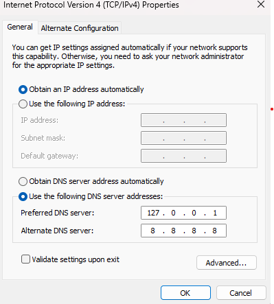

# DNSNotify

## Sistēmas izkārtojums


## Grupas dalībnieku sniegums un projekta apraksts


# Sistēmas Uzstādīšana un izmēģinājums ar datu bāzi
## 1. Uzstādīšana
* Instalē Docker desktop
* Noklonē DNSNotify repozitoriju
### 1.1 Standarta uzstādīšana
* Šeit tiks lokāli uzstādīta visa sistēma - coredns, vector, clickhouse, nats, ml-model, grafana, mattermost u.c.
* Izveido docker network
```docker network create netw```
* No DNSNotify\Application mapes izpilda komandu:
```docker compose up -d --build --remove-orphans```
  * Ja izpildes laikā parādās ziņojums "mattermost hook exited with status 255", tad ir nepieciešams mainīt Application/mattermost/mattermost-setup.sh failu no CRLF uz LF
### 1.2 Uzstādīšana pietuvināti reālajai videi
* Šeit tiks lokāli uzstādīti tikai coredns, vector un test-client konteineri un izveidots savienojums ar centrālu serveri, kurā jau darbojas visi pārējie servisi
* Šajā implementācijā nebūs tieša pieeja clickhouse datubāzei, bet būs pieejama grafana apmeklējot lapu - visual.harak.lat
* Piekļuve mattermost arī tiks nodrošināta no lapas matmost.harak.lat (Vēl jāimplementē mattermost)
* No DNSNotify\Application mapes izpilda komandu:
```docker compose -f local.yml up -d --build --remove-orphans```
* Kad vajadzēs izslēgt, tad jāizpilda komanda:
```docker compose -f local.yml down```
### 1.3. Uzstādīšana ar docker swarm
* Swarm konfigurācija tiks ņemta no prod.yml faila
* Izpilda komandu ```docker swarm init```
* Izpilda komandu ```docker network create --driver overlay --attachable netw```
* Palaiž visus swarm servisus - ```./deploy.ps1```
* Kad vajag izslēgt - ```./stop-stack.ps1```
* Ja vajag izslēgt un izdzēst visus volumes - ```./purge-stack.ps1``` - ja parādās kļūdas, tad izpildīt vēlreiz līdz brīdim, kad saka "Purge complete"
* Ja gadījumā kas, tad var apturēt arī izmantojot ```docker stack rm dnsnotify```
* Var apskatīties vai strādā - ```docker service ls```
* Log faili konkrētam konteinerim - ```docker service logs dnsnotify_<servisa nosakums>```

## 2. Izmēģinājums
* Šobrīd automātiski tiek veikta automātiska dns pieprasījumu veikšana no test-client konteinera (katras 30 sekundes)
* Sadaļā 2.1 ir redzams veids, kā to izdarīt manuāli, ja nepieciešams
* Ja nevēlas veikt speciālu konfigurāciju, tad var izlaist atlikušo šajā sadaļā
### 2.1 Manuāla DNS pieprasījumu veikšana
* Vispirms jāizveido savienojums ar konteineru, kas veiks DNS pieprasījumus:
```docker compose exec test-client /bin/sh```
* Izpilda dig komandu 
```dig @coredns rtu.lv``` - rtu.lv aizvieto ar jebkuru citu domēnu
* Tagad izveidojas papildu ieraksts clickhouse datubāzē
### 2.2 Izmēģinājums veicot dns pieprasījumus no sava lokālā datora (windows)
* Šis ir labākais veids kā pārbaudīt reālus dns pieprasījumus
* Kad ir palaists docker compose, tad ir jānokonfigurē serveris ko izmantos dns pieprasījumiem
* Var izmantot informāciju no šīs [saites](https://www.pdq.com/blog/change-dns-server-settings-in-windows/) (Sadaļā - How to change DNS server settings using Control Panel) 
* Kad tiek līdz dns konfigurācijas logam, veic šādu iestatījumu:

* Tagad visi dns pieprasījumi, kas tiks veikti no lokālā datora, tiks apstrādāti un ierakstīti clickhouse datubāzē
* Kad ir pabeigta testēšana, atiestatīt iepriekšējos dns iestatījumus (Nekas slikts nenotiks, ja to neizdarīs)
* Jāatcerās, ka daļa no pieprasījumiem vēl aizvien tiek automātiski sūtīta no test-client
* Ja gadījumā neizskatās, ka pieprasījumi tiek veikti, tad cmd terminālī izpildīt komandu
```ipconfig /flushdns```
* Ja vienalga nerādās, tad iespējams, ka uz datora ir programma, kas jau lieto 53 portu un tādēļ coredns nevar palaisties
* To ir grūtāk atrisināt, var paprasīt chatgpt vai google


## 3. Datu bāzes aplūkošana
### 3.1 Ja pilnā sistēma palaista lokāli
* Atver clickhouse datubāzi
```docker compose exec clickhouse clickhouse-client --user default --password default```
* Izpilda komandu, lai apskatītu tabulu, kurā tagad vajadzētu būt vismaz vienam ierakstam
```SELECT * FROM dns_logs;```
* Svarīgākos datus var izvilkt ar komandu
```SELECT log_time,client_ip,domain,prediction,malicious_probability FROM dns_logs;```
* Ja clickhouse datubāzē nerādās jauni ieraksti, tad pamēģiniet docker compose failā izmainīt coredns konteinera portus uz
```yaml
    ports:
      - "8353:53/tcp"
      - "8353:53/udp"
```
* Pēc tam veikt restartu
```docker compose down```
```docker compose up -d --build --remove-orphans```
### 3.2 Ja tiek izmantots centrālais serveris
* Atver grafana lapu - visual.harak.lat
* Lietotājvārds - admgf499
* Parole - SuperDrosalietotajaparole3!
* Šī informācija ir izmaināma .env failā
* Tālāk ir jāizveido savienojums ar clickhouse datubāzi (savienošanas informācija ir pieejama .env failā)
* Jāizveido dashboards un jāpievieno vizualizācijas (Ja tie jau nav izveidoti)

## 4. Mattermost paziņojumu aplūkošana
* Mattermost datubāzei var piekļūt, izmantojot admin lietotāju
* Lokālai piekļuvei tiek izmantots http://localhost:8065
* Lietotājvārds - admin
* Parole - SuperDrosaMattermostParole!
* Paziņojumu kanālu var atrast, izmantojot **Add Channels -> Browser Channels**

## Piezīmes
* Coredns šobrīd domēna IP adresi neatgriež
* ==================== (Pievienots 01.05.2025) ====================
* Fluent-Bit log failu pārsūtīšanai tagad ir aizvietots ar Vector
* Log failu saņemšanai no CoreDNS+Vector tagad izmanto NATS - tas log failus ieliek rindā un tos paņem ml-model, kad process nav aizņemts
* Ar NATS implementāciju FastAPI vai Flask vairs nav vajadzīgs
* Servisu/konteineru konfigurācija tagad ir pieejama .env failā
* Funkcijas, kas atbild par datu/log apstrādi tagad ir pieejamas  failā
*  failā ir pieejamas funkcijas, kas izveido savienojumus ar NATS un Clickhouse
* Ja tiek mainīta clickhouse saglabātās dns_logs tabulas struktūra ( failā), tad jāmaina arī konfigurācija  failā
* Ja tiek mainīta tabulas struktūra, tad ir jāizdzēš clickhouse konteinera volumes
```docker compose down -v``` vai ```docker compose down clickhouse -v```
* Tika izveidots pagaidu konteiners, kas "sūta" (Vēl ir jāveic MatterMost implementācija) brīdinājumus uz MatterMost
* test-client direktorijā ir pieejams fails , kurā ir pieejami domēni, kas tiek izmantoti automātiskajai testēšanai
* ==================== (Pievienots 02.05.2025) ====================
* Tagad visas izmaiņas, kas tiek publicētas main branch, automātiski tiek izvietotas uz publiska servera
* Šobrīd ir publiski atvērti divi linki - visual.harak.lat un matmost.harak.lat, attiecīgi abiem servisiem (Patiesībā būs atvērti tikai no kāda 04.05)
* Ja ir nepieciešams izdzēst docker volumes, kas atrodas uz publiskā servera, tad dodiet ziņu (Tās neizdzēsīsies automātiski)
* Patestējot sistēmu, kas aprakstīta 2.2 sadaļā var redzēt, ka daudzi leģitīmi dns pieprasījumi tiek klasificēti kā ļaunprātīgi
* Tas nozīmē, ka būs daudz brīdinājumu ziņu uz mattermost
* Uz attālinātā servera arī ir uzstādīts test-client, kas veic automātiskus pieprasījumus (To jāņem vērā, ja skatās datubāzi izmantojot 3.2 sadaļā aprakstīto)
* Šobrīd klienta IP adreses datubāzē vienmēr uzrādās kā 172....
* Lai to novērstu visdrīzāk būtu jāpārvieto coredns un vector implementācija uz citu serveri un uz datora tikai jāiestata dns servera IP adrese (Lai gan arī šajā gadījumā IP adreses drošvien uzrādītos kā 198.168...)
* Taču tas vairāk pietuvotos reālai videi
* Protams šos vector un coredns konteinerus var palaist arī uz tā paša servera, kur ir clickhouse, nats un pārējie servisi, bet tad sliktāka mērogojamība
* ==================== (Pievienots 17.05.2025) ====================
* Tagad ir pieejams arī publisks dns serveris, kas ir piesaistīts pie primārā harak.lat servera
* Tas darbojas uz amazon virtuālās mašīnas
* To var nokonfigurēt uz windows izmantojot 2.2. solī minēto informāciju, bet tagad vairs nav nepieciešams neko citu palaist uz personīgā datora, vajag nokonfiguēt tikai dns iestatījumus (Tagad 127.0.0.1 vietā jāiestata 18.208.150.9)
* DNS pieprasījumi parādīsies visual.harak.lat dashboardā, kad no datora veiks dns pieprasījumus - lietos pārlūku vai vienkārši eksistēs (windows :D)


